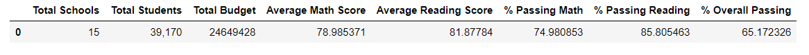
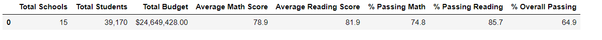
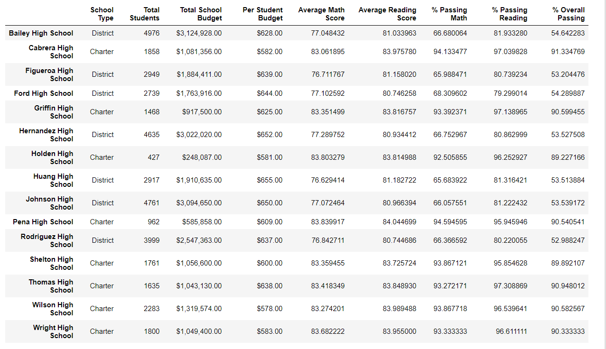
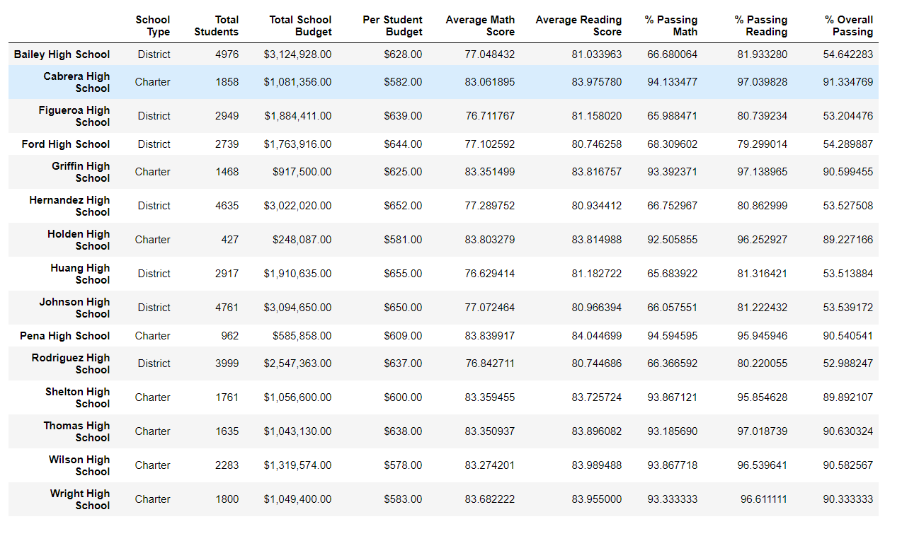

# School District Analysis

## Overview of the School District Analysis

The purpose of the project was to assist Maria, to analyze standardized test data and other school information for a school district to gather insights and trends. To perform the analysis we had datasets relating to the school funding standardized test scores. These data sets were used to show school performance. Based on the analysis and key metrics discovered, stakeholders will make decisions for school spending and budgets in the district. After initial analysis, it was found that “Thomas High School,” which was one of the schools in the data set had grades altered for the 9th graders. As a result, stakeholders wanted the metrics to be recalculated by excluding the standardized test scores for math and reading for “Thomas High School.” The metrics calculated earlier were updated and this report summarizes how the exclusion of data from this school mentioned above affected the overall analysis. 

## Results

After excluding math and reading scores for “Thomas High School” and recalculating our metrics the following effects of the above-mentioned changes were found in our analysis: 

### Affect on the district summary: 

  Before the exclusion of data 

  

  After the exclusion of data 

  

In our district summary analysis, we can see that the exclusion of the data only resulted in minor changes for the percentage of students passing Math, Reading, and the    overall figure. As we can see the overall percentage went down from 65.17% to 64.9%.

### Affect on School Summary: 

Before the exclusion of data 

  

  After the exclusion of data 

  

From our images, we can see that exclusion of the data had a far greater impact on this data. The percentage passing for math went down to 66.9% from 93.2%. The same can be seen for reading percentages. The overall percentage also dropped to 65.07% from 90.9%. This indicates that 9th graders in particular for Thomas High School had a lot of students earlier who passed the standardized tests.  

### Replacing 9th graders math and reading scores and effect on Thomas High School’s performance relative to the other schools: 

Before replacing the data for 9th graders for Thomas High School, Thomas high school was the second-best performing school in the district. Also, after the exclusion of data for 9th graders, Thomas High School was ranked 2nd among the 15 schools in the district. 

### Affect on Math and Reading Scores by Grade:

After removing all the math and reading scores for Thomas High School, there were no values for math and average reading scores by grade. 

### Scores by school spending size:
Thomas High School was in a spending range between $630-644, and for this spending group, the exclusion of 9th-grade scores for Thomas High School had no effect in the overall percentage passing for this group.
  
### Scores by School Size:

Thomas High School is a medium-sized school, and for this group, the exclusion of 9th-grade scores for Thomas High School had no effect on the overall percentage passing for this group.

### Scores by School Type:
Thomas High School is a charter school, and for this group, the exclusion of 9th-grade scores for Thomas High School had no effect on the overall percentage passing for this group.

## Summary

For our analysis of the results after exclusion of the 9th-grade scores for Thomas High School we can deduce the following major changes to our analysis from before: 
  - The overall percentage for passing went down a lot for Thomas High School in the summary analysis. 
  - It had minimal impact on district analysis, which can conclude that there is a lower amount of students enrolled in Thomas High School compared to other schools. 
  - There was no change observed in overall school type, size, or school spending groups
  - It can be deduced that overall, other than skewing the results in the School results analysis, the exclusion of this data had minimal impact on other metrics calculated. 
